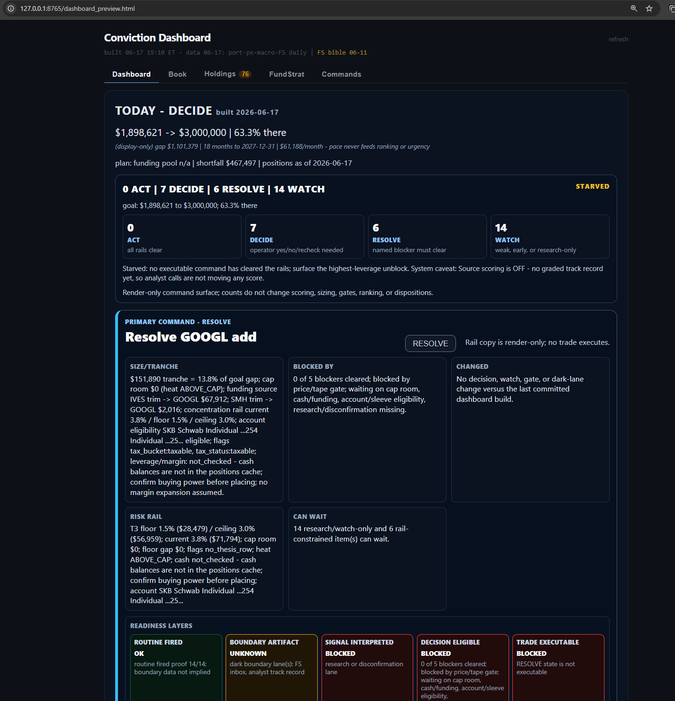
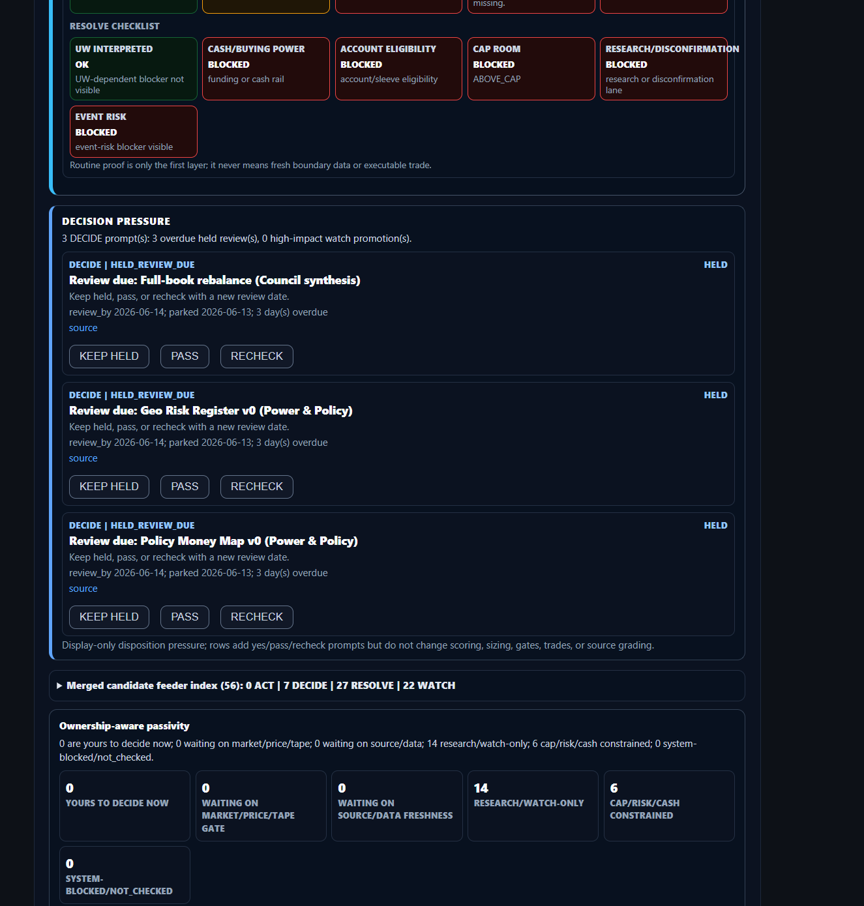
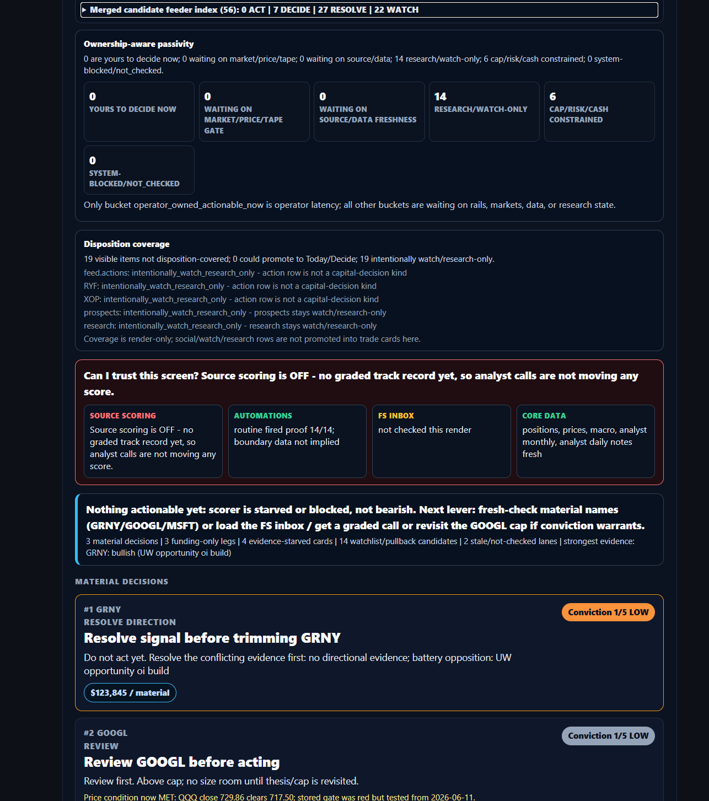
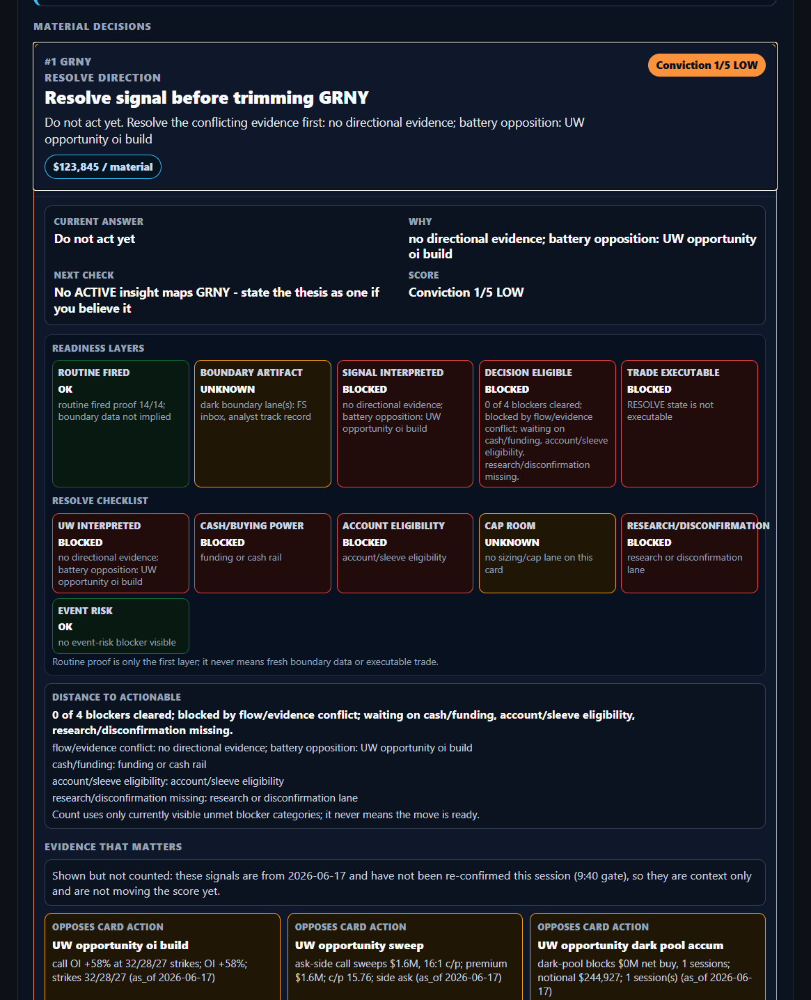
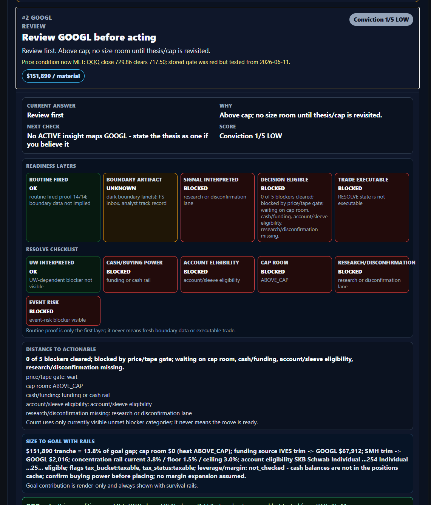
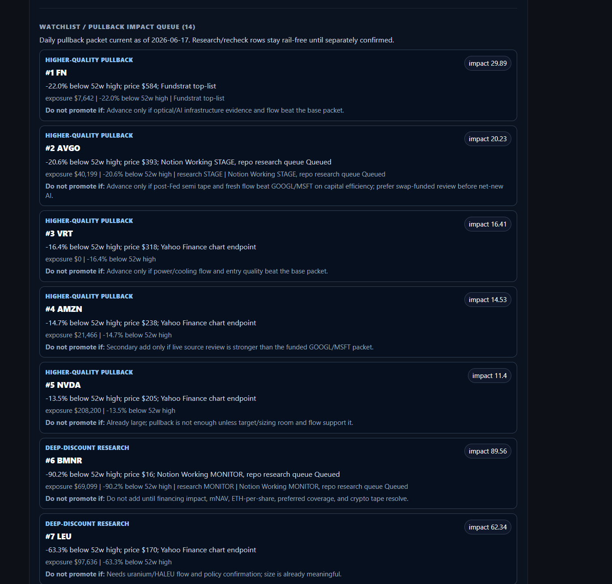

# TODAY/DECIDE Human Usability Reset - 2026-06-17

This packet preserves the operator's critique and screenshots from the
2026-06-17 TODAY/DECIDE action-forcing build. It supersedes any interpretation
that the prior slice was "done" just because it was technically honest and
verified. The dashboard remained too complex for the operator to act from.

Notion mirror: https://app.notion.com/p/383c50314bb6818cb8e0e502b47dd108

## Operator Original Text

> This is honestly so much more confusing. Look at the screenshots carefully. The first several screens are not even. I don't know, it's a lot of useless stuff, and a lot of the stuff needs to be minimized, for one thing. Too much information is being shown to me at once, and not enough is related to the primary objective.
>
> I also don't understand what the decision pressure boxes are. I think I understand what this generally is, but the actual decisions, I don't understand them. The choices, I don't really understand them either.
>
> Keep held, I guess I kind of understand, but what does that affect? Pass, does that mean I'm just not deciding right now? Recheck, tap that, but I don't know what that actually does. This is not very useful, honestly.
>
> Ownership aware passivity. I'm not sure what that is, but surely too high up. The first things I should be seeing are the things I should do.
>
> This really needs to be more human usable and polished, especially for me and aligned with our primary objectives. The most basic part of the primary objective, which maybe isn't included, is that things need to be very simple and easy for me to action and do and understand.
>
> Start by drafting a goal and storing the screenshots in my original text forever. Give me a goal that I'm going to enter into Kodak's as a goal to help you reach the actual objectives, because otherwise I've been kind of spinning my wheels on this and not really hitting the target.

## Screenshots

1. 
2. 
3. 
4. 
5. 
6. 

## Diagnosis To Preserve

The prior build improved honesty but failed the human action test. It surfaced
truthful state labels, readiness layers, and blockers, but it still made the
operator parse system vocabulary before understanding the next move.

Specific failures:

- The first viewport is dominated by diagnostic categories and internal state,
  not by the next thing the operator should do.
- "Decision pressure" is not self-explanatory. It reads like a system queue,
  not a decision the operator can answer.
- Button labels such as KEEP HELD, PASS, and RECHECK do not explain their effect.
- "Ownership-aware passivity" is internal taxonomy and should not sit above the
  actual actions.
- Readiness and resolve checklists are too prominent and too verbose for the
  first pass. They are useful audit detail, not the primary experience.
- Material cards still require too much interpretation. The operator needs a
  plain-language question, the recommended answer, the consequence of each
  choice, and the one next unblock if action is blocked.
- The watchlist/pullback queue is a wall of useful context, but it should not
  compete with the decisions that move capital.

## Copy-Ready Codex Goal

Redesign TODAY/DECIDE into a human-action cockpit, not a diagnostic dashboard.
Start from the saved 2026-06-17 usability critique and screenshots in
`docs/ux_feedback/2026-06-17-today-decide-human-usability-reset/`. The first
screen must answer, in plain English: What should I do now? Why? What exact
choice is needed from me? What happens if I choose each option? What single
thing blocks execution if it is not executable yet?

Make the surface simple and action-centered for the operator. Hide or minimize
system plumbing unless it changes the decision. Replace or demote jargon such
as "Decision pressure", "Ownership-aware passivity", and raw readiness layers
with operator-facing language. Every visible button must explain its effect
before or inside the button row: keep waiting, dismiss this candidate until a
date, start a concrete recheck, or open the exact evidence needed. The first
viewport should show one primary action/question and no more than two next-best
items; audit details and full queues belong behind drill-downs.

Hard constraints: display-only unless separately approved; no changes to
scoring, sizing, gates, trade execution, source grading, or disposition
semantics. Preserve the honesty rail: do not promote neutral UW to support, do
not fake source scoring, do not manufacture urgency, and do not loosen survival
rails. Weak stays quiet, blocked stays blocked, risk stays visible.

Acceptance criteria:

- First viewport makes the next operator decision obvious in under 10 seconds.
- It uses plain-English labels and questions, not internal taxonomy.
- Every button has an understandable effect and no button implies trade
  execution unless rails are actually clear.
- Raw readiness/proof/passivity diagnostics are collapsed below the action
  surface by default.
- The primary card states the recommended answer, the reason, the consequence,
  and the next unblock in short human language.
- Desktop and mobile screenshots are visually checked for readability.
- Tests prove the change is presentational only and does not alter ranking,
  scoring, sizing, gates, trades, source grading, or disposition semantics.

## Design Principle Added

Simple enough to act is part of the Investing OS primary goal. A screen can be
honest and still fail if the operator has to decode it. The target is not more
visible system state; the target is fewer, clearer decisions with the evidence
and risk close enough to trust.
